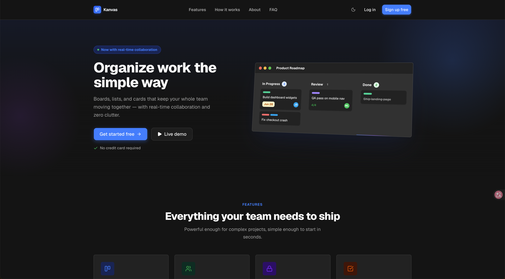
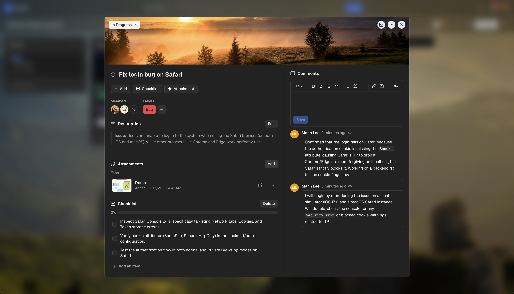
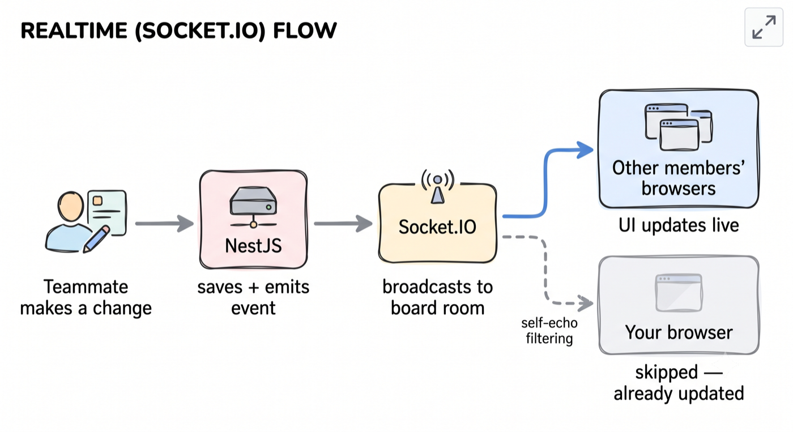
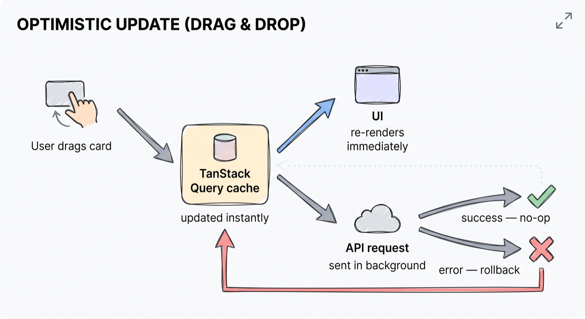

<div align="center">


# Kanvas

**A real-time Kanban board for teams — boards, lists, cards, and live collaboration.**

**[🔗 Live Site](https://kaban.io.vn)**

[](https://nextjs.org) [](https://react.dev) [](https://www.typescriptlang.org) [](https://tailwindcss.com) [](https://tanstack.com/query) [](https://socket.io)
[](https://github.com/LeeManh/kaban-fe/actions/workflows/ci.yml)

</div>

<details>
<summary>Table of Contents</summary>

- [About](#about)
- [Screenshots](#screenshots)
- [Tech Stack](#tech-stack)
- [Features](#features)
- [Technical Highlights](#technical-highlights)
- [Architecture](#architecture)
- [Getting Started](#getting-started)
  - [Prerequisites](#prerequisites)
  - [Installation](#installation)
  - [Environment Variables](#environment-variables)
  - [Running the App](#running-the-app)
- [Scripts](#scripts)
- [Project Structure](#project-structure)
- [Conventions](#conventions)

</details>

## About

Kanvas is the frontend for a Kanban-based project management app — drag-and-drop boards/lists/cards,
real-time sync across collaborators, comments, checklists, attachments, and notifications. It talks
to a separate NestJS backend, [`kaban-api`](https://github.com/LeeManh/kaban-api), over REST + Socket.IO.

## Screenshots

### Landing page



### Real-time sync


### Card detail



## Tech Stack

| Layer         | Choice                                             |
| ------------- | -------------------------------------------------- |
| Framework     | [Next.js 16](https://nextjs.org) (App Router)      |
| Language      | TypeScript                                         |
| Styling       | Tailwind CSS v4                                    |
| UI primitives | shadcn/ui on top of [Base UI](https://base-ui.com) |
| Data fetching | TanStack Query                                     |
| Forms         | react-hook-form + zod                              |
| Drag & drop   | dnd-kit                                            |
| Rich text     | Tiptap                                             |
| Real-time     | Socket.IO client                                   |
| Toasts        | sonner                                             |

## Features

- **Boards, lists & cards** — create, drag-and-drop reorder, copy list, move list (incl. across boards), move all cards in a list
- **Cards** — description, due dates + reminders, labels, checklists, attachments, comments, cover images, assignees
- **Real-time collaboration** — board/list/card changes sync live across members via Socket.IO
- **Notifications** — in-app bell, email preferences, desktop notifications
- **Auth** — register/login, forgot/reset password
- **Sharing** — invite links, join requests, board member roles
- **Search & filters** — board search, recently viewed, per-board card filters

## Technical Highlights

Notable problems solved beyond typical CRUD wiring:

- **Self-echo filtering for real-time updates** — every socket event carries the acting user's ID; the client skips re-invalidating its own mutations (which already apply an optimistic update), avoiding double-renders/flicker while still syncing other clients instantly.
- **Centralized mutation error handling** — a single TanStack Query `MutationCache` shows error toasts for every mutation by default, with a `meta.skipErrorToast` escape hatch for mutations that need custom (e.g. field-level) error handling — no per-hook boilerplate.
- **Optimistic UI + lazy fetching** — drag-and-drop reordering applies the change to the TanStack Query cache immediately via `onMutate`/`setQueryData` (with automatic rollback on failure), so the UI never waits on an API round-trip to reflect a move. Secondary data (card details, board members, invites, join requests) is fetched lazily via `enabled` flags tied to popover/dialog open state, instead of eagerly on mount.
- **Cross-board list moves** — lists move between boards via a board + position picker (not drag), migrating cards, labels, and member assignments in a single transaction, while filtering out assignees who aren't members of the target board. Same-board reordering uses drag-and-drop, with position computed from neighboring items and synced back to the API.
- **Room-scoped real-time sync** — clients join/leave Socket.IO rooms per board as they navigate, so updates only broadcast to members actively viewing that board.

## Architecture





## Getting Started

### Prerequisites

- Node.js (LTS) + npm
- The [`kaban-api`](https://github.com/LeeManh/kaban-api) backend running locally (this app is a pure frontend and expects an API to talk to)

### Installation

```bash
npm install
```

### Environment Variables

Create a `.env` file in the project root:

| Variable              | Description                                           |
| --------------------- | ----------------------------------------------------- |
| `NEXT_PUBLIC_API_URL` | Base URL of the `kaban-api` backend                   |
| `NEXT_PUBLIC_APP_URL` | Public URL of this app (used for Open Graph metadata) |
| `UNSPLASH_ACCESS_KEY` | Unsplash API key, used for board background photos    |

### Running the App

```bash
npm run dev
```

Open [http://localhost:5173](http://localhost:5173) with your browser — dev server runs on port `5173`, not the Next.js default `3000`.

## Scripts

| Script          | Description                      |
| --------------- | -------------------------------- |
| `npm run dev`   | Start the dev server (port 5173) |
| `npm run build` | Production build                 |
| `npm run start` | Start the production server      |
| `npm run lint`  | Run ESLint                       |

## Project Structure

```
app/
├── (app)/            # authenticated app shell (boards, profile, settings)
│   ├── boards/[boardId]/  # board detail — _components, _hooks per feature
│   ├── (profile)/         # profile & settings pages
│   ├── _components/       # app-shell-wide components (navbar, notifications...)
│   ├── _context/          # socket provider, app shell context
│   └── _hooks/            # app-shell-wide hooks
├── (auth)/            # login, register, password reset, invites
└── _components/       # marketing/landing page components

components/
├── ui/                 # shadcn/ui primitives (Button, Dialog, Select...)
└── ...                  # shared app-wide components

lib/
├── api/                # REST client functions per resource (boards, cards, lists...)
└── socket.ts            # Socket.IO client singleton
```

Route-local `_components/` and `_hooks/` folders are scoped to the route they live under — shared
components live in the top-level `components/` folder.

## Conventions

This repo runs against a customized fork of Next.js — **APIs, conventions, and file structure may
differ from what you'd expect.** Before writing code, read [`AGENTS.md`](./AGENTS.md) and the
relevant docs under `node_modules/next/dist/docs/`.
